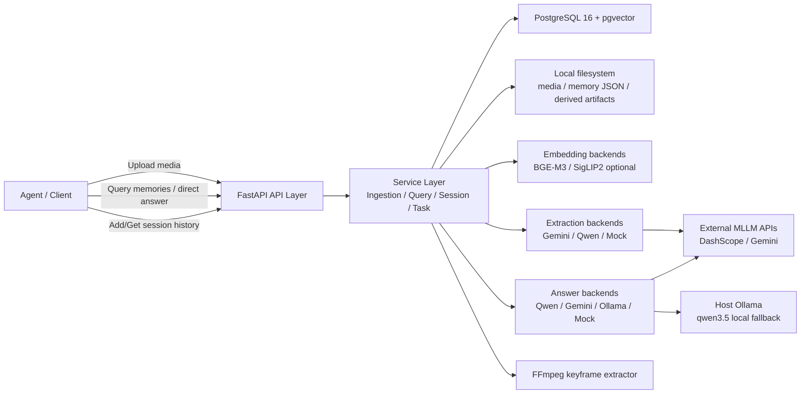
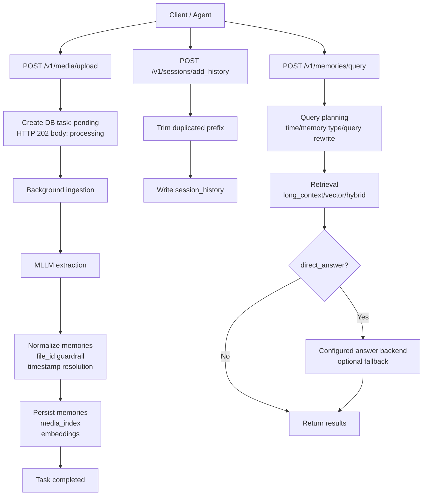
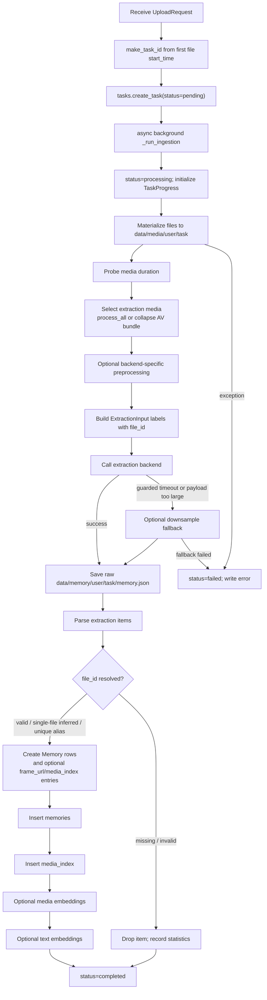
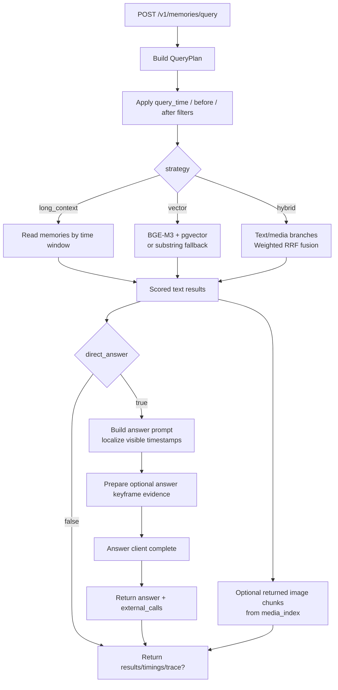
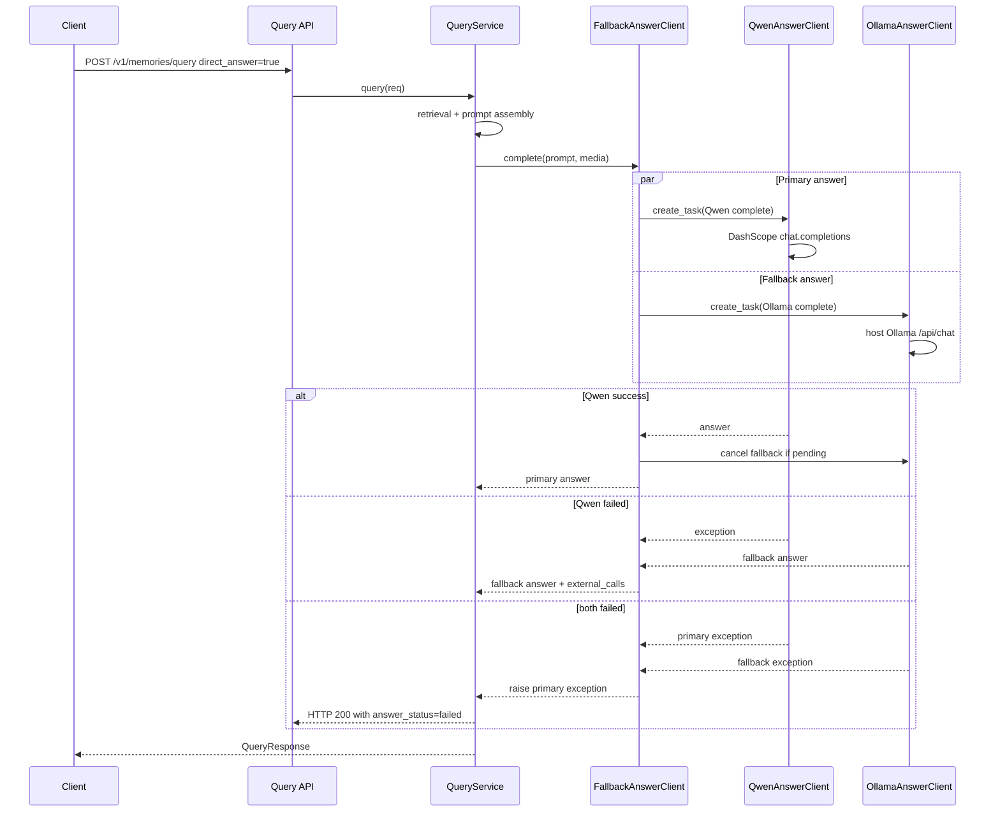
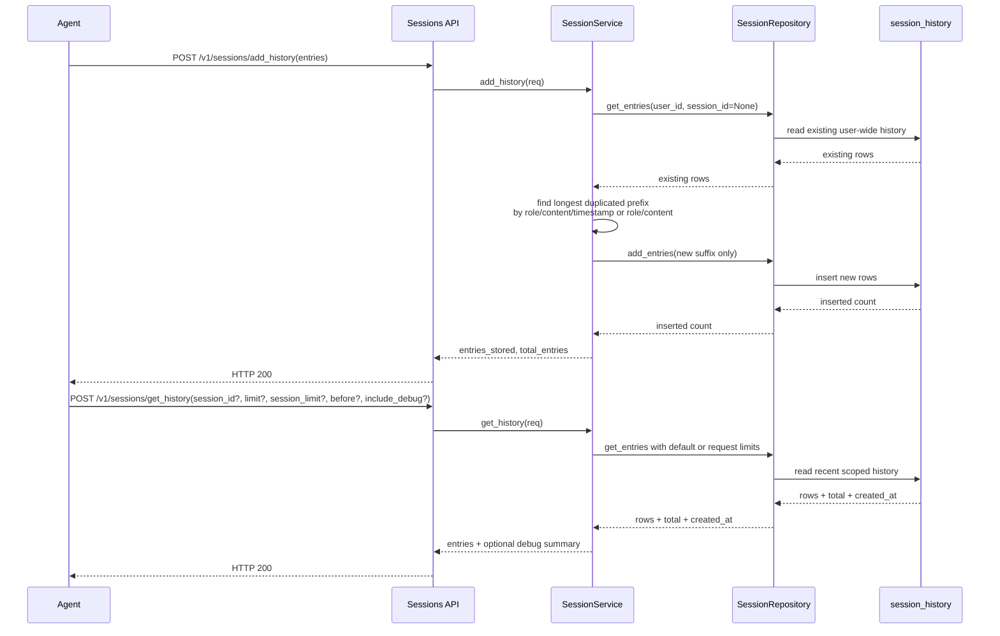
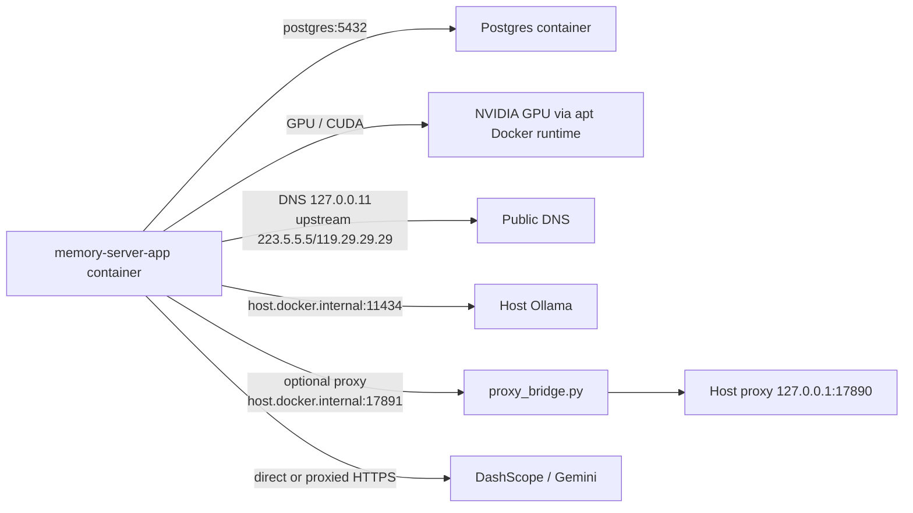
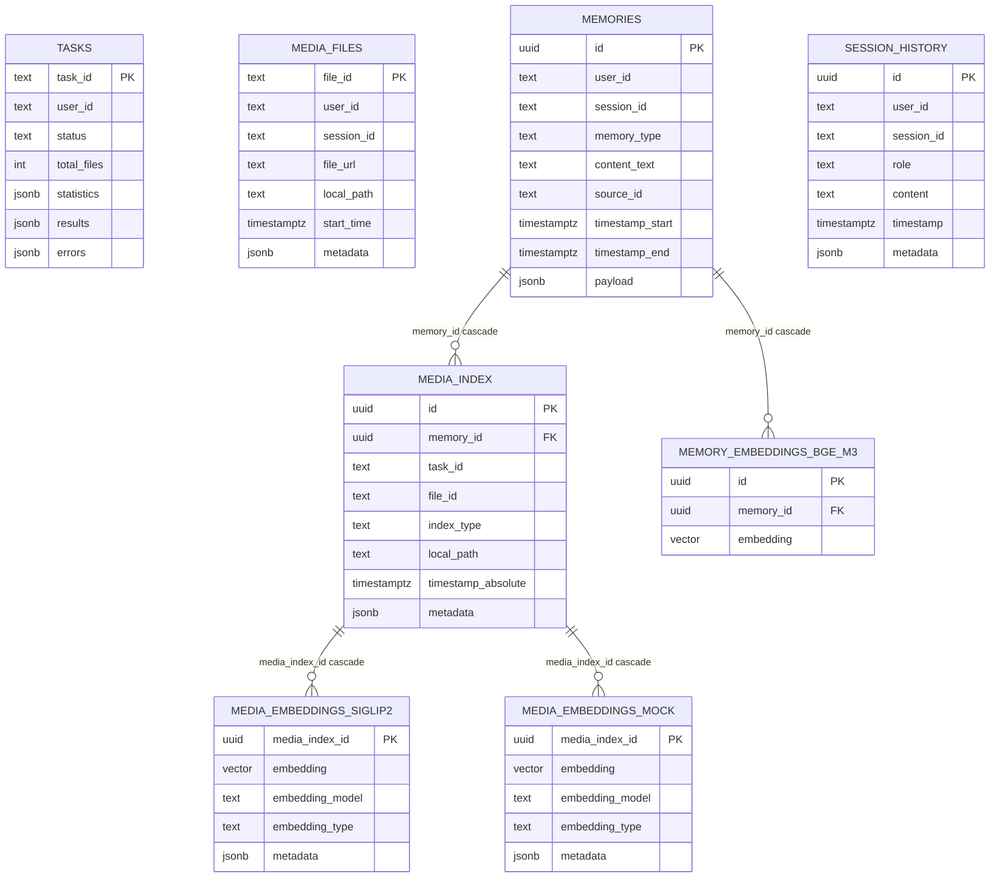

# Memory Server 软件实现设计说明书

> 仅供内部使用。本文是外部 Memory Server 的实现参考，不是 assistant_agent 的核心架构权威。assistant_agent 侧长期记忆边界以 `docs/memory-service-architecture.md` 为准；HTTP contract 以 `docs/memory_server_api_spec.md` 为准。

## 文档信息

| 项目 | 内容 |
| --- | --- |
| 产品名称 Product name | Memory Server |
| 产品版本 Product version | v0.1.0 / 2026 展示运行版 |
| 文档名称 | 软件实现设计说明书 |
| 拟制 Prepared by | Memory Server 项目组 |
| 日期 Date | 2026-06-18 |
| 审核 Reviewed by | 待定 |
| 批准 Granted by | 待定 |

## 修订记录 Version Control

| 日期 Date | 修订版本 Version | 描述 Description | 作者 Prepared by |
| --- | --- | --- | --- |
| 2026-06-18 | V1.0 | 按软件实现设计模板整理当前 memory server 设计，补充核心流程图、时序图、接口、DFx 与测试建议。 | Memory Server 项目组 |

## 1. Story 概述（必要）

| 包需求名称 | 设计需求名称 | Story 名称 | Story 描述 | 是否做 Story 设计 |
| --- | --- | --- | --- | --- |
| 个人记忆服务 | 多模态记忆抽取、检索与问答服务 | Memory Server 当前实现设计 | 将用户上传的视频、音频、图片或文本材料转化为结构化 memory，支持按用户/会话检索、历史记录读写、直接回答、外部大模型调用观测和展示环境稳定运行。 | 是 |

### 1.1 背景说明

Memory Server 的目标是作为 agent 的长期记忆后端：接收来自端侧或 agent 的媒体输入、对媒体内容做多模态抽取、形成可检索的文本 memory，并在查询时结合向量检索、时间过滤、会话历史和 answer backend 生成自然语言回答。

当前实现服务于两个目标：

1. 研究 baseline：提供相对完整的 ingestion / retrieval / answer 链路，便于评估多模态记忆抽取与检索策略。
2. 展示运行版：在本地 GPU + Docker 环境下稳定运行，优先保证上传、检索、问答和 fallback 可用。

### 1.2 当前实现范围

- 媒体上传与异步 ingestion task。
- 多模态抽取 backend：Gemini / Qwen / Mock。
- 文本 memory 持久化、BGE-M3 embedding、PostgreSQL + pgvector 检索。
- keyframe / media index 机制，当前展示配置默认关闭 keyframe 抽取和 direct-answer 图片证据。
- Query planner、long-context / vector / hybrid retrieval。
- Direct answer backend：Gemini / Qwen / Ollama / Mock，并支持配置化并发 fallback；Docker 展示配置使用 Qwen 主链路 + Ollama fallback。
- Session history add/get，支持增量前缀去重、默认读取最近若干会话。
- Docker GPU 运行环境、代理桥接、容器 DNS 固定、Ollama 预热脚本。
- 临时展示辅助脚本：清理用户最近 session 的 history 与 memories。

### 1.3 非目标与约束

- 当前服务未提供生产级鉴权、配额、租户隔离和公网暴露安全边界，默认用于受控内网或本机展示环境。
- 当前 memory extraction 仍依赖外部 MLLM 质量，物体漏检、时间错配和 provider 超时仍需要通过 prompt、模型和数据集持续优化。
- `media_files.file_id` 当前为全局主键，调用方需要保证 `file_id` 全局唯一；后续可演进为 `(user_id, session_id, file_id)` 复合约束。
- 文件系统 artifact 删除与数据库 cascade 删除未完全绑定；清理脚本主要用于展示调测，不是持久产品接口。

## 2. Story 上下文（必要）

### 2.1 系统上下文



### 2.2 内部模块边界

| 模块 | 责任 | 主要文件 |
| --- | --- | --- |
| API layer | HTTP request/response、Pydantic 校验、后台任务投递。 | `src/memory_server/api/*.py` |
| Config/Wiring | 按 mock/production/testing 模式组装 repo、service、backend。 | `src/memory_server/app.py`, `src/memory_server/config.py` |
| IngestionService | 媒体落盘、外部抽取、memory 解析、keyframe/media embedding、DB 写入、task progress。 | `src/memory_server/services/ingestion.py` |
| QueryService | Query planning、retrieval、media chunk 扩展、direct answer、trace/timing。 | `src/memory_server/services/query.py` |
| SessionService | session history add/get、增量前缀去重、默认 limit/session_limit。 | `src/memory_server/services/sessions.py` |
| External backends | Gemini/Qwen/Ollama/embedding/FFmpeg/DB adapter。 | `src/memory_server/backends/**` |
| Logging | request id、结构化日志、敏感字段脱敏、DB/external call 摘要。 | `src/memory_server/logger/**` |

### 2.3 外部组件与运行环境

| 组件 | 用途 | 当前展示配置 |
| --- | --- | --- |
| PostgreSQL + pgvector | memories、tasks、media index、embedding、session history 持久化。 | Docker service `postgres` |
| Docker apt runtime + NVIDIA toolkit | app 容器访问 GPU，用于 BGE-M3 embedding。 | `docker/compose.yaml` `gpus: all` |
| BGE-M3 | 文本 embedding。 | 容器内 `device: cuda`，模型通过本地 HF cache mount |
| DashScope Qwen | extraction 或 answer backend。 | answer 主链路 `qwen3.5-flash`，`use_proxy=false`，容器 DNS 固定 |
| Gemini | extraction 或 answer backend，可用于能力对比。 | 配置保留 |
| Ollama | 本地 answer fallback。 | Host 服务，app 通过 `host.docker.internal:11434` 访问 |
| Proxy bridge | 容器访问 host 代理。 | `docker/start_proxy_bridge.sh` 提供 `host.docker.internal:17891` |

## 3. 功能点分解（必要）

| 序号 | 功能点名称 | 功能点描述 |
| --- | --- | --- |
| 1 | 媒体上传与异步任务 | `POST /v1/media/upload` 接收一个或多个媒体文件，创建 task，异步执行 ingestion。 |
| 2 | 媒体 materialization | 支持 HTTP/HTTPS URL、本地路径、`file://`；统一复制/下载到 task 目录，记录 `media_files`。 |
| 3 | 多模态记忆抽取 | 调用 Gemini/Qwen/Mock extraction backend，保存 raw `memory.json`，解析为 episodic/semantic/procedural/spatial memories。 |
| 4 | 多文件 provenance guardrail | 要求模型回填 `file_id`，服务端做 valid/inferred/aliased/missing/invalid 解析；无法可靠定位的 item fail closed。 |
| 5 | Keyframe/media index | 从 memory 时间点选取 keyframe，写入 `media_index`；可作为 query image chunk 或 answer 多模态证据。 |
| 6 | Embedding 写入 | 使用 BGE-M3 对 `content_text` 做 embedding，写入 `memory_embeddings_bge_m3`；可选 media embedding。 |
| 7 | 记忆检索 | 支持 long_context、vector、hybrid retrieval；支持 user/session scope、memory_types、时间过滤。 |
| 8 | Query planning | 可选 heuristic/Qwen/Gemini planner，拆分 retrieval query、answer query、时间窗口和 memory type。 |
| 9 | Direct answer | 基于检索结果组装 prompt，调用 answer backend；支持用户可见时区，不改变存储时间。 |
| 10 | Answer fallback | 配置化 primary/fallback answer backend 并发启动，主链路失败时返回已启动的 fallback 结果；Docker 展示配置为 Qwen + Ollama。 |
| 11 | Session history add/get | 支持会话历史增量写入、默认读取最近 80 条/3 个 session、debug 摘要字段。 |
| 12 | 任务状态与可观测性 | `POST /v1/tasks_status` 返回阶段、统计、错误、external call 摘要；query 返回 timings、可选 trace，以及 answer 阶段 external_calls。 |
| 13 | 展示运行稳定性 | Docker DNS 固定、Ollama 预热、GPU smoke test、代理桥接、临时清 session 脚本。 |

## 4. 实现设计（必要）

### 4.1 功能实现思路（必要）

整体实现采用 FastAPI + service orchestration + backend adapter 分层：

- API 层只负责 HTTP contract 和 request validation，不承载业务状态机。
- Service 层承载核心编排：ingestion、query、session、task progress。
- Backend 层封装外部依赖：DB、LLM provider、embedding model、FFmpeg、Ollama。
- 数据持久化以 PostgreSQL 为主，文件系统保存原始媒体、raw extraction JSON 和派生 keyframe。
- 展示运行版将 app、Postgres 放在 Docker 中，Ollama 放在 WSL host，以减少 app 容器显存压力和模型冷启动风险。

关键设计点：

1. Ingestion 与 HTTP upload 解耦：upload 立即返回 `202`，后台 task 处理耗时操作。
2. 时间统一使用 timezone-aware timestamp：存储和检索过滤使用 UTC/数据库时区语义，answer 时区只影响面向用户的文字表达。
3. 对外部 provider 失败做分层兜底：extraction 支持 downsample fallback，answer 支持本地 Ollama 并发 fallback。
4. 多文件输入 fail closed：无法可靠解析 file provenance 的 extraction item 不落库，避免生成错误时间/错误视频来源的 memory。
5. 查询链路保留可替换策略：long_context 用于稳定读取最近上下文，vector 用于语义检索，hybrid 用于 text/media 融合实验。
6. 展示配置以稳定为先：keyframe/media embedding 可关闭；Qwen answer 直连依赖固定容器 DNS；Ollama fallback 预热并保持加载。

### 4.2 功能实现设计（必要）

#### 4.2.1 整体业务流程图



图说明：该图描述 Memory Server 的三条核心业务链路。媒体上传链路以 task 为边界异步完成 ingestion，完成后形成可检索的 memories、media index 和 embeddings；session history 链路独立写入 `session_history`，用于给 agent 恢复近期会话上下文；query 链路在检索后根据 `direct_answer` 决定返回结构化结果，或继续调用 answer backend 生成自然语言回答。三条链路共享 `user_id/session_id` 作为隔离和查询范围，但 session history 不会自动写入 canonical memories。

#### 4.2.2 Ingestion 流程图



图说明：Ingestion 的输入是 upload task 中 materialized 后的媒体文件，输出是 DB 中的 memory rows、可选 media index、可选 media embeddings 和 text embeddings。upload 会先创建 `pending` task，但 HTTP response body 固定返回 `status=processing`；后台 `_run_ingestion` 随后把 DB task 更新为 `processing`。服务会 materialize 全部输入文件并登记到 `media_files`，然后按 `extraction.media_selection` 决定哪些文件进入 extraction；Docker 展示配置使用 `collapse_duplicate_av_bundle/prefer_video_audio`，只影响抽取输入，不影响媒体登记。调用 extractor 前可按 backend 做预处理派生输入，当前 Docker 配置只对 Qwen backend 生效，而展示 ingestion backend 是 Gemini，因此默认不会触发。primary extraction 失败后，只有在 downsample fallback 启用且错误命中 timeout/payload-too-large 条件，并且成功创建派生输入时，才会以 `downsample_fallback` 再抽取一次；否则 task failed。多文件场景下，只有 valid `file_id`、单文件 inferred `file_id`、或唯一 filename/basename alias 的 item 会落库，missing/invalid item 会被丢弃并记录统计。keyframe/media index entry 会在 DB memory insert 前生成并可回填 `frame_url`，实际 DB 写入顺序是 memories、media_index、可选 media embeddings、可选 text embeddings；production Docker 配置会启用 text embedding，mock/testing 可跳过。

#### 4.2.3 Query + Direct Answer 流程图



图说明：Query 先构造 `QueryPlan`，包括 answer query、text/media retrieval query、时间窗口、memory type 和 planner trace 信息。`long_context` 按时间窗口读取并保留靠近 `before_timestamp` 的最新 `top_k` 条；`vector` 在 embedder/repository 可用时使用 BGE-M3 dense embedding 走 pgvector cosine search，不可用时回退到 repository substring search；`hybrid` 通过 text/media 分支和 weighted RRF 融合，lexical 分支目前只保留配置和 trace warning，未接实际 backend。Docker 展示配置目前关闭 media vector 分支。`direct_answer=false` 返回检索结果、timings 和可选 trace；`direct_answer=true` 使用 `plan.answer_query`、文本 memory 和按 answer 选项单独准备的 keyframe evidence 组装 prompt。返回结果中的 media chunks 是 answer 之后按 `query.include_media_chunks` 追加给客户端的展示证据，默认不进入 answer prompt。answer 中可见时间按 `options.timezone`、`answer.default_timezone`、`Asia/Shanghai`、`UTC` 的顺序选择合法时区。

#### 4.2.4 Answer fallback 时序图



图说明：Answer fallback 是并发兜底，不是在主链路失败后才启动。默认开发配置是 Gemini answer 且 fallback 关闭；Docker 展示配置显式使用 Qwen primary + Ollama fallback。启用 fallback 时，`FallbackAnswerClient` 同时创建 primary 和 fallback 任务；primary 成功时取消或丢弃 fallback，primary 失败时等待已经在运行的 fallback 结果。若两个 backend 都失败，`QueryService` 捕获异常并返回 HTTP 200，同时设置 `answer_status=failed`、`answer_error` 和 `external_calls`，让调用方能看到检索结果和失败原因。为避免 retry 与并发 fallback 叠加导致不可控尾延迟，启用 fallback 时 app wiring 会拒绝 answer backend retry 配置。

#### 4.2.5 Session history add/get 时序图



图说明：`add_history` 的增量识别以同一 `user_id` 的历史记录为参照，而不是只看当前 `session_id`。服务在 incoming entries 中查找能在既有 user-wide history 中匹配到的最长前缀，匹配键优先使用 `(role, content, normalized timestamp)`，并在无 timestamp 的场景下降级到 `(role, content)`，最终只写入未匹配的 suffix。`get_history` 未传 `session_id` 时从最近活跃的 `session_limit` 个 session 中取记录，再按 `limit` 返回最新 N 条并保持时间正序；传入 `session_id` 时只读取该 session，`session_limit` 不参与过滤。`include_debug=true` 时只返回 hash、长度、metadata keys 等调试摘要，不返回额外全文副本。

#### 4.2.6 容器运行与网络流程图



图说明：Docker runtime 中 app 和 Postgres 在 compose 网络内通信，app 通过 apt Docker 的 NVIDIA runtime 使用 GPU。构建/拉取镜像使用宿主侧 Docker daemon 网络和 `127.0.0.1:17890` 代理；容器运行时则通过 `host.docker.internal:17891` 的 bridge proxy 访问宿主代理，二者不是同一个配置面。compose 同时给 app 固定公共 DNS upstream，降低 WSL 内部 DNS `10.255.255.254` 不稳定导致 DashScope/Gemini 解析失败的概率；Ollama 位于 WSL host，通过 `host.docker.internal:11434` 被 app 调用。

#### 4.2.7 流程说明

正常流程：

1. Agent 上传媒体，服务返回 task id；后台异步处理。
2. Ingestion 保存媒体和 raw extraction JSON，解析出 memory rows，按配置写入 media index、media embeddings 和 text embeddings。
3. Agent 轮询 task 状态，确认 completed。
4. Agent 查询 memories，服务按策略检索并可生成 direct answer。
5. Agent 在会话期间或结束时写入 session history；下一次会话可读取最近 history。

异常流程：

- 媒体下载失败：task 标记 failed，错误写入 `tasks.errors` 和 statistics。
- Extraction provider timeout：如果 downsample fallback 启用、错误命中 guarded 条件且成功创建派生输入，生成低码率/低分辨率派生输入再重试；否则 task failed。
- 多文件 extraction 缺失/错误 `file_id`：只有 valid、单文件 inferred、唯一 alias 的 item 落库；missing/invalid item 丢弃，task statistics 记录 unresolved 计数。
- Keyframe 失败：默认不影响 ingestion 成功；仅记录 statistics。若 `keyframes.fail_ingestion_on_error=true` 才会导致 task failed。
- Embedding 失败：production Docker 的 text embedding 是 ingestion 核心链路的一部分，失败会影响 task 完成；未配置 embedder/repository 时跳过。media embedding 默认关闭，可配置为不阻塞 ingestion。
- Query 无结果：普通 query 返回 HTTP 200 和空 `results`；只有 `direct_answer=true` 且文本/媒体检索均无结果时，才返回 `answer_status=no_results`。
- Answer 主链路失败：启用 fallback 时 fallback 已并发启动，主链路失败后返回 fallback；若 fallback 也失败，HTTP 仍返回 200，`answer_status=failed` 并带错误摘要。
- Docker/WSL DNS 异常：app 容器已固定 DNS upstream，避免依赖不稳定的 WSL 内部 `10.255.255.254`。

### 4.3 数据库及文件持久化设计（可选）

#### 4.3.1 数据模型



主要表说明：

| 表 | 关键字段 | 说明 |
| --- | --- | --- |
| `tasks` | `task_id`, `user_id`, `status`, `total_files`, `processed_files`, `failed_files`, `statistics`, `results`, `errors`, `created_at`, `updated_at` | upload task 生命周期、阶段统计、错误和调试结果。 |
| `media_files` | `file_id`, `user_id`, `session_id`, `file_url`, `local_path`, `filename`, `media_type`, `start_time`, `metadata`, `created_at` | 输入媒体的 provenance 和本地 materialized path。 |
| `memories` | `id`, `user_id`, `session_id`, `memory_type`, `content_text`, `source_id`, `timestamp_start`, `timestamp_end`, `frame_url`, `topic`, `subtopic`, `payload`, `created_at` | canonical text memory；`source_id` 当前为 task 级逻辑来源，不是数据库外键。 |
| `media_index` | `id`, `user_id`, `session_id`, `task_id`, `file_id`, `memory_id`, `index_type`, `local_path`, `uri`, `timestamp_offset_ms`, `timestamp_absolute`, `selection_method`, `rank`, `score`, `metadata`, `created_at` | 派生媒体索引，当前主要是 keyframe；`memory_id` 外键随 memory 删除级联。 |
| `memory_embeddings_bge_m3` | `id`, `memory_id`, `embedding`, `created_at` | BGE-M3 1024 维文本向量；`memory_id` 唯一并级联删除，向量列建 HNSW cosine index。 |
| `media_embeddings_siglip2` | `media_index_id`, `embedding`, `embedding_model`, `embedding_type`, `metadata`, `created_at` | SigLIP2 768 维 image-text 向量；默认展示配置关闭。 |
| `media_embeddings_mock` | `media_index_id`, `embedding`, `embedding_model`, `embedding_type`, `metadata`, `created_at` | 测试用 8 维媒体向量表。 |
| `session_history` | `id`, `user_id`, `session_id`, `role`, `content`, `timestamp`, `metadata` | agent/user 会话历史，独立于 canonical memories。 |

#### 4.3.2 文件路径

| 类型 | 路径 |
| --- | --- |
| 原始媒体 materialized 文件 | `{storage.base_dir}/media/{user_id}/{task_id}/{blob_name}` |
| Raw extraction JSON | `{storage.base_dir}/memory/{user_id}/{task_id}/memory.json` |
| Extraction 预处理派生文件 | `{storage.base_dir}/derived/{safe_user_id}/{safe_task_id}/extraction_preprocessing/{backend}/...` |
| Extraction downsample fallback 派生文件 | `{storage.base_dir}/derived/{safe_user_id}/{safe_task_id}/extraction_fallback/{reason}/...` |
| Keyframe 派生文件 | `{storage.base_dir}/derived/{safe_user_id}/{safe_task_id}/keyframes/{safe_file_id}/{offset_ms:09d}.{format}` |

说明：原始媒体和 raw extraction JSON 当前使用 task 原始 `user_id/task_id` 目录；extraction 派生文件和 keyframe 路径使用 `safe_path_component` 进行路径组件安全化。数据库删除不会自动删除文件系统 artifact，临时清理脚本只用于展示调测，不作为长期数据生命周期 API。

#### 4.3.3 数据割接与回退

当前无自动数据割接逻辑。新库通过 `migrations/001_initial.sql` 初始化完整 schema，其中已经包含 `media_embeddings_siglip2` 和 `media_embeddings_mock`；`migrations/002_media_embeddings.sql` 是给既有库补充媒体向量表的幂等迁移，Docker 初始化时两者都会挂载，依赖 `CREATE TABLE IF NOT EXISTS` 避免重复创建。展示调测如需清理最近 session，使用 `scripts/clear_last_session.py`，该脚本是临时运维工具，不作为长期 API。

回退策略：

- 代码回退：使用 Git commit 回退。
- Docker runtime 回退：保留 `docker/config.yaml`，可切回 `answer.fallback.enabled=false` 或关闭 direct answer。
- 数据回退：如未备份，只能通过清理对应用户/session/task 的 DB rows 和 filesystem artifact 实现逻辑回退；生产化前需补充正式备份与迁移机制。

### 4.4 接口描述（必要）

#### 4.4.1 HTTP API

| 接口 | 方法 | 说明 |
| --- | --- | --- |
| `/v1/health` | GET | 查询服务健康状态、memory 数量、最新 timestamp。 |
| `/v1/media/upload` | POST | 提交媒体上传 task，后台异步 ingestion。 |
| `/v1/tasks_status` | POST | 查询 task 状态、阶段统计、结果和错误。 |
| `/v1/memories/query` | POST | 检索 memories，可选 direct answer。 |
| `/v1/sessions/add_history` | POST | 写入 session history，并对重复前缀做增量剪裁。 |
| `/v1/sessions/get_history` | POST | 读取 session/user history，支持 `session_id`、`limit`、`session_limit`、`before`、`include_debug`。 |

详细字段定义见 `memory_server_api_spec.md`。

#### 4.4.2 内部接口

| 内部接口 | 说明 |
| --- | --- |
| `IngestionService.process_upload(...)` | upload task 的核心 ingestion 编排入口。 |
| `QueryService.query(req)` | query/retrieval/answer 编排入口。 |
| `SessionService.add_history(req)` | history 增量写入入口。 |
| `SessionService.get_history(req)` | history 读取入口。 |
| `FallbackAnswerClient.complete(prompt, media)` | 并发启动 primary/fallback answer backend。 |
| `TaskProgress` | 记录 ingestion 阶段、耗时、external calls、统计。 |

#### 4.4.3 第三方 SDK / 服务

| 第三方服务 | 使用方式 | 关键配置 |
| --- | --- | --- |
| DashScope Qwen | OpenAI-compatible chat completions。 | `DASHSCOPE_API_KEY`, `answer.qwen.base_url`, `use_proxy` |
| Gemini | Google generative model API。 | `GEMINI_API_KEY`, `answer/extraction.gemini.model` |
| Ollama | HTTP `/api/chat`。 | `answer.ollama.base_url`, `model`, `num_ctx`, `num_predict`, `keep_alive` |
| PostgreSQL/pgvector | asyncpg + vector search。 | `DATABASE_URL`, migrations |
| Transformers/SentenceTransformers | BGE-M3/SigLIP2 加载和编码。 | local HF cache mount, `device=cuda` |

### 4.5 GUI 界面（可选）

当前 Memory Server 是后端服务，不涉及 GUI 界面。展示侧 UI/Agent 不在本仓实现范围内。

### 4.6 代码设计（必要）

#### 4.6.1 目录结构

```text
src/memory_server/
  api/                 FastAPI routers
  services/            Ingestion / query / session / task orchestration
  backends/
    answer/            Gemini / Qwen / Ollama / fallback / mock
    extraction/        Gemini / Qwen / derivatives / mock
    embedding/         BGE-M3 / SigLIP2 / mock
    db/                PostgreSQL repositories
    keyframe/          FFmpeg keyframe selection/extraction/indexing
    media/             Media materialization/probe
  logger/              request/db/redaction logging
  config.py            Pydantic config model
  models.py            API/domain Pydantic models

docker/
  compose.yaml         app/postgres runtime
  config.yaml          Docker runtime config
  Dockerfile           Python 3.13 + uv image
  start_proxy_bridge.sh
  prewarm_ollama.sh

scripts/
  clear_last_session.py
  query_stress_runner.py
  ingestion_stress_runner.py
```

#### 4.6.2 关键模块/类与职责

| 模块/类 | 设计说明 |
| --- | --- |
| `AppConfig` | 配置根模型，覆盖 server、runtime、database、storage、external_calls、extraction、embedding、media_embeddings、retrieval、query_planning、answer、ingestion、sessions、keyframes、logging 等配置域；`DATABASE_URL` 环境变量会覆盖 YAML 中的数据库连接。 |
| `create_app(...)` / `_wire_production(...)` | FastAPI 应用装配入口；production mode 下创建 Postgres pool、repositories、extractor、embedders、media materializer、keyframe indexer、ingestion/query/session services。 |
| `api/*` routers | 对外 HTTP 边界，负责 Pydantic 请求/响应、request logging、task 状态查询和错误映射。 |
| `IngestionService` | upload task 后台处理编排：媒体 materialization、duration probe、extraction media selection、extraction 调用、raw JSON 保存、memory normalization、keyframe/media index、text/media embedding 和 task progress。 |
| `QueryService` | query 编排：QueryPlan、long_context/vector/hybrid retrieval、media chunks、answer prompt、timezone 展示、keyframe evidence、answer backend 调用、trace/external_calls。 |
| `SessionService` | session history 读写编排；`add_history` 对同一 user 的既有 history 做最长重复前缀剪裁；`get_history` 应用默认 `limit/session_limit` 并生成可选 debug 摘要。 |
| `TaskProgress` | 记录 ingestion 阶段、耗时、statistics、external_calls 和错误，用于 task status 与日志排查。 |
| `PostgresTaskRepository` | 持久化 task 生命周期、阶段统计、结果和错误。 |
| `PostgresMediaRepository` | 持久化输入媒体文件元数据和本地路径。 |
| `PostgresMemoryRepository` | 持久化 canonical memories，支持按时间读取、按 id 读取、计数、latest timestamp 和 substring fallback search。 |
| `PostgresEmbeddingRepository` | 持久化 BGE-M3 text embeddings，并通过 pgvector/HNSW 做 cosine search。 |
| `PostgresMediaIndexRepository` | 持久化 keyframe 等 media index，并按 memory id/id 查询。 |
| `PostgresMediaEmbeddingRepository` | 持久化可选 image-text media embeddings，并按 query image-text vector 检索 media evidence。 |
| `PostgresSessionRepository` | 持久化 `session_history`；支持按 session、按 user、按最近 session 范围和 `before` 时间过滤读取。 |
| `DefaultMediaMaterializer` | 将上传请求中的 URL、本地路径或数据写入 task 媒体目录，并记录媒体下载 external calls。 |
| `ConfiguredExtractionPreprocessor` | 在配置启用时为指定 extraction backend 预生成视频派生文件，降低 provider payload 和处理时延。 |
| `Gemini/Qwen extraction clients` | 封装 Gemini/Qwen 多模态抽取；Qwen 支持 streaming、inline media 限制和 stream retry；Gemini 通过统一 retry helper 记录 external call。 |
| `BGE-M3/SigLIP2 embedders` | 封装 text embedding 和 image-text embedding；Docker 展示配置使用 CUDA BGE-M3，media embedding 默认关闭。 |
| `MediaIndexService` / `KeyFrameIndexer` | 基于 memory 时间戳和媒体 start time 选择 keyframe，生成 `media_index` 记录和派生图片。 |
| `FallbackAnswerClient` | 并发启动 primary/fallback answer backend；primary 成功则取消 fallback，primary 失败则使用 fallback，两个都失败时向上抛 primary error 并保留 external_calls。 |
| `Qwen/Gemini/Ollama answer clients` | 封装 direct answer backend；Qwen/Gemini 可接收 keyframe media evidence，Ollama 当前只处理文本 prompt 并会记录忽略 media evidence 的 warning。 |

#### 4.6.3 运行时行为与配置边界

- Docker 展示运行版以 `docker/config.yaml` 为配置入口，Dockerfile 通过 `--config docker/config.yaml` 启动 app；`config/default.yaml` 是通用开发默认配置，二者不是同一运行 profile。
- compose 注入 `DATABASE_URL`、API key、proxy、DNS、TZ、GPU 和模型 cache mount；`DATABASE_URL` 优先级高于 YAML，因此 Docker 服务实际连接 compose 中的 Postgres。
- runtime mode 分为 `mock` 和 `production`：mock 使用内存仓库和 mock backend 便于单元测试；production 使用 Postgres、真实 extractor/embedder/answer backend 和文件系统持久化。
- 展示配置中 `retrieval.default_strategy=vector`、`query.include_media_chunks=false`、`media_embeddings.enabled=false`、`keyframes.enabled=false`、`ingestion.extract_keyframes=false`，因此当前演示主链路是 text-only memory extraction + BGE-M3 dense vector retrieval + optional direct answer。
- `answer.fallback.enabled=true` 时，primary 和 fallback backend 必须不同；同时 app wiring 会拒绝 answer retry 配置，避免 SDK retry、统一 retry 和并发 fallback 叠加造成不可控延迟。
- Qwen answer 当前 `max_retries=0`、`enable_thinking=false`、`use_proxy=false`；Gemini answer `max_retries=0`；Ollama fallback 使用 host `http://host.docker.internal:11434`、`num_predict=192`、`keep_alive=-1m`。
- Docker app 容器固定 DNS 只影响 app runtime 的外部域名解析，不改变 Docker daemon build/pull 网络；构建仍按宿主 Docker daemon 的 proxy/DNS 配置执行。
- Answer 时区只影响 prompt 中给用户看的时间表达，不改变 memories/session_history 的存储时间、retrieval filter 或数据库排序语义。

## 5. DFx 设计（可选）

### 5.1 性能设计

| 关注点 | 设计 |
| --- | --- |
| Upload 响应时间 | 上传接口只创建 task 并返回 202，耗时 ingestion 在后台执行。 |
| Ingestion 并发 | 当前 upload 通过 `asyncio.create_task` 启动后台任务，未实现全局 ingestion task 并发阀门；`ingestion.max_workers` 目前只配置 app.state.thread_pool，不能视为 upload 并发限流。 |
| Embedding 性能 | Docker app 使用 GPU BGE-M3；本地模型 cache mount，避免重复下载。 |
| Query 性能 | `top_k`、retrieval strategy、media chunks、answer keyframe budget 可配置。 |
| Answer 延迟 | Docker 展示配置使用 Qwen 主链路 + Ollama 并发 fallback；Ollama 通过预热和 `keep_alive=-1m` 降低冷启动。 |
| 大上下文风险 | `history_default_limit=80`、`history_default_session_limit=3`、retrieval `top_k` 控制上下文大小。 |
| 展示稳定性 | 容器 DNS 固定，proxy bridge 可用，Ollama 本地 fallback 作为云端链路异常兜底。 |

建议性能指标：

- `/v1/health`: P95 < 200ms。
- 无 direct answer 的 vector query：P95 < 2s（取决于 DB 和 embedding GPU 状态）。
- Docker direct answer Qwen 主链路：目标 P95 < 8s，超时/异常由 fallback 兜底。
- Ollama fallback：预热后目标单次 < 15s，`num_predict=192` 下不保证云端同等质量。
- Ingestion：按视频长度、provider 响应、抽取策略评估，不承诺短时同步完成。

### 5.2 安全设计

| 检查项 | 结论 |
| --- | --- |
| 日志打印检查 | request id、阶段、耗时、错误摘要会打印；不应打印 API key、完整 prompt、完整 history/content。 |
| 是否涉及个人数据打印 | 涉及 memory/history 内容，当前 debug 接口只返回长度、hash、metadata keys；日志需继续避免全文输出。 |
| 是否新增网络请求/响应 | 涉及 DashScope、Gemini、Ollama、媒体 URL 下载。 |
| 是否涉及敏感数据 | API key、用户媒体、session history、memory 内容均为敏感数据。 |
| 是否新增 WebView | 不涉及。 |
| 本地持久化文件、数据库字段 | PostgreSQL 和本地文件系统保存个人媒体、抽取文本、历史记录。 |
| 新增组件对外暴露 | FastAPI HTTP API 暴露；当前无鉴权，默认仅内网/本机受控环境。 |
| 加密、签名 | 当前未实现字段级加密；依赖部署网络边界和数据库/磁盘访问控制。 |

安全约束与建议：

- 环境变量中保存 API key，禁止提交 `.env`。
- 生产化前必须补充认证、授权、用户隔离、请求限流、数据保留策略和删除接口。
- 文件路径 materialization 和 keyframe 输出已做部分逃逸防护；`user_id/task_id` 目录安全化仍需继续审视。
- `external_calls` 不记录完整 payload；错误消息经过 URL 敏感 query redaction。事件字段可能包含 provider、operation、状态、耗时、attempts、attempt durations、media counts、answer role/backend、model/options、Ollama token/eval stats 等。

### 5.3 兼容性设计

- HTTP API 当前为 `/v1/*`，新增字段应保持向后兼容：客户端未知字段可忽略，服务端 optional 字段有默认值。
- `GetHistoryRequest.limit/session_limit` 未传时使用配置默认值 `80/3`；显式传 `null` 表示不限制；显式传 `0` 是合法非负值，结果为空；`session_limit` 仅在未指定 `session_id` 时参与过滤。
- `options.timezone` 只影响 answer 文本，不改变 retrieval/filter/store 语义，避免破坏已有时间数据。
- `answer.fallback` 为新增配置，默认关闭；Docker 展示配置显式开启。
- 数据库 migration 使用 `CREATE TABLE IF NOT EXISTS` 和 `CREATE INDEX IF NOT EXISTS`，适合空库或幂等初始化；复杂 schema 演进需后续引入正式 migration 工具。

### 5.4 全球化

- 服务端内部时间使用 ISO 8601 / timezone-aware datetime；数据库使用 `TIMESTAMPTZ`。
- Direct answer 支持 IANA timezone：请求 `options.timezone` 优先，然后依次使用 `answer.default_timezone`、`Asia/Shanghai`、`UTC`。
- Prompt 要求回答优先使用相对时间，必要时给出时分，只有必要时给完整绝对时间。
- 多语言检索当前主要依赖 BGE-M3 dense embedding，支持中英混合；未启用 BGE-M3 sparse/late-interaction 能力。

### 5.5 日志上报、BI、可维护性

| 项目 | 涉及/不涉及 | 说明 |
| --- | --- | --- |
| 日志上报 | 涉及 | request log、task progress、answer external call event、provider failure。 |
| BI 上报 | 当前不涉及 | 没有独立 BI 管线；benchmark/stress 脚本可离线分析。 |
| 可维护性 | 涉及 | 分层 adapter、配置化 backend、focused tests、trace/external_calls。 |

可维护性设计：

- `trace` 是 opt-in，由 `query.return_trace` 或请求 `options.trace` 开启；`QueryResponse.external_calls` 当前只收集 answer client/fallback wrapper 事件，不是完整 query 链路追踪。
- `TaskProgress.statistics` 记录 ingestion 阶段和 fallback 结果。
- Backend adapter 边界清晰，便于替换 Qwen/Gemini/Ollama/embedding。
- Docker README 记录启动顺序、proxy bridge、Ollama 预热和 DNS 注意事项。

### 5.6 可靠性与降级设计

| 场景 | 设计 |
| --- | --- |
| 统一 retry helper | `call_with_retries` 支持 attempts、指数退避、最大退避、attempt duration 上限、retryable 判断和 redacted error summary；成功/失败事件进入 `external_calls` 或 task statistics。 |
| 媒体下载 | HTTP media download 使用统一 retry helper 和 `media_download_timeout_seconds`；本地文件 copy 不做 retry。 |
| Gemini extraction/answer | Gemini `generate_content` 使用统一 retry helper，SDK `max_retries` 作为 SDK 层配置另行记录；本地文件上传和 File API processing 有独立 timeout/轮询事件。 |
| Qwen extraction | Streaming extraction 使用统一 retry helper，但 timeout 不重试，避免长时间阻塞 ingestion；non-stream extraction 主要依赖 OpenAI SDK `timeout/max_retries`，事件中记录 `sdk_max_retries`。 |
| Qwen answer | Qwen answer 主要依赖 OpenAI SDK `timeout/max_retries`，本项目事件中 `attempts=1` 并记录 `sdk_max_retries`；Docker 展示配置设为 `max_retries=0` 以配合并发 fallback。 |
| Ollama answer | Ollama answer 无 retry，使用 HTTP timeout；当前忽略 media evidence，只作为文本 fallback。 |
| Answer fallback | 启用时 primary/fallback 并发启动；primary 成功取消 fallback，primary 失败使用已在运行的 fallback；fallback 与 answer retry 互斥。两个 backend 都失败时 query 仍返回 HTTP 200，`answer_status=failed`。 |
| Query planner | Planner 可关闭；启用 LLM planner 时，请求级 query overrides 会跳过 planner；planner 未配置、调用失败或输出解析失败且 `fail_open=true` 时回退 heuristic，并在 trace plan 中暴露 source/warnings。 |
| Query no result | 普通 query 无结果返回 HTTP 200 和空 `results`；direct answer 无文本/媒体命中时返回 `answer_status=no_results`。 |
| Ingestion fallback | Extraction downsample fallback 仅在配置开启、错误命中 timeout/payload-too-large 且能创建派生输入时执行；fallback 失败则 task failed。 |
| Health degraded | `/v1/health` 仅对 schema missing (`UndefinedTableError`) 返回 degraded；普通数据库连接异常会按接口错误暴露。 |

### 5.7 容量、数据生命周期与运维边界

- PostgreSQL volume、`data/`、`logs/` 和模型 cache 需要独立容量监控；视频、raw extraction JSON、derived keyframes/downsample 文件会持续增长。
- 当前没有正式数据保留、备份、恢复和用户级删除 API；`scripts/clear_last_session.py` 是展示调测工具，不是长期产品能力。
- Docker 展示配置关闭 keyframes/media embeddings/media chunks，降低显存、磁盘和 query latency 压力；后续如启用 long context/hybrid/media vector，需要重新评估 `top_k`、prompt token 和响应延迟上限。
- 容器 `TZ=Asia/Shanghai` 仅影响日志/进程本地时间展示；服务内部存储、filter、排序仍基于 timezone-aware timestamp 和数据库 `TIMESTAMPTZ`。

## 6. 测试设计（必要）

### 6.1 单元测试（UT）

重点覆盖：

- Config parsing 与 app wiring：`tests/test_helpers/test_config_app_helpers.py`。
- Answer fallback：primary success、primary fail fallback success、both fail。
- Session history：重复前缀识别、默认 limit/session_limit、debug 字段。
- Query planner：时间窗口、query rewrite、invalid planner output fallback。
- Retrieval fusion：weighted RRF、branch rank、media-vector parent projection。
- Ingestion parser：file_id valid/inferred/aliased/missing/invalid，timestamp resolution。
- Keyframe/media index helper：路径安全、selector、failure handling。
- Clear session script：删除计数解析、DB URL 脱敏。

运行方式：

```bash
PATH=/home/mcs/anaconda3/envs/memory313/bin:$PATH ./scripts/run_tests.sh -q
```

### 6.2 接口测试

建议覆盖：

| 接口 | 测试点 |
| --- | --- |
| `/v1/health` | 正常、按 user/session scope 统计、schema missing degraded。 |
| `/v1/media/upload` | 单文件、多文件、非法字段、task 创建、HTTP response status 与 DB task 初始状态。 |
| `/v1/tasks_status` | pending/processing/completed/failed、task 不存在、statistics 完整性。 |
| `/v1/memories/query` | long_context/vector/hybrid、time filters、memory_types、direct_answer、trace、timezone。 |
| `/v1/sessions/add_history` | 正常写入、重复前缀剪裁、缺必填字段、字段校验。 |
| `/v1/sessions/get_history` | 默认 limit/session_limit、显式 `null`/`0`、before、include_debug、负数返回 422。 |

### 6.3 业务场景测试

1. 展示脚本上传一段视频，等待 task completed，查询“手机放在哪里”等 spatial memory。
2. 连续会话：session A 写 history，session B 读取最近若干 session history，验证返回范围受默认 `limit/session_limit` 控制，不会导致 agent 上下文超限。
3. Direct answer：Qwen 正常时使用主回答；模拟 Qwen 失败时返回 Ollama fallback。
4. 时间表达：上传 UTC 时间数据，查询时设置 `Asia/Shanghai`，验证回答符合北京时间表达。
5. Retrieval 对比：相同 query 分别用 long_context、vector、hybrid，比较命中 memory 和回答稳定性。
6. 展示重置：运行 `scripts/clear_last_session.py` 清理指定 user 最近 session，再重新录入脚本数据。

### 6.4 异常场景测试

| 异常场景 | 预期 |
| --- | --- |
| DashScope/Gemini DNS 失败 | Answer 阶段的 Qwen/Gemini 失败事件进入 `QueryResponse.external_calls`；ingestion 阶段 provider 失败进入 task statistics；answer fallback 可返回 Ollama。 |
| Ollama 未启动 | 预热脚本失败；answer fallback 失败时 query 返回 `answer_status=failed`。 |
| Provider timeout | extraction 在满足配置和错误条件时可触发 downsample fallback；answer 按 backend/fallback 策略记录失败摘要。 |
| 模型输出缺失 file_id | 多文件时 item 不落库，statistics 记录 unresolved。 |
| Keyframe 生成失败 | 默认 ingestion 继续成功，statistics 记录失败。 |
| DB schema 缺失或不可用 | schema missing 时 health degraded；普通连接异常按接口错误暴露，task 无法正常更新。 |
| GPU 不可用 | embedding/model 加载失败；Docker smoke test 应先阻断启动验收。 |
| 容器 DNS 失效 | app 服务应使用 compose 固定 DNS；若仍失败，走 proxy 或修复 WSL/Docker DNS。 |

### 6.5 展示前验收建议

1. 启动顺序：

```bash
./docker/start_proxy_bridge.sh
./docker/prewarm_ollama.sh
sudo docker compose --env-file docker/.env -f docker/compose.yaml up -d postgres app
```

2. Smoke tests：

```bash
curl --noproxy '*' -sS http://127.0.0.1:5200/v1/health
sudo docker exec memory-server-app getent hosts dashscope.aliyuncs.com
sudo docker exec -i memory-server-app /app/.venv/bin/python - <<'PY'
import torch
print(torch.cuda.is_available())
PY
```

3. Live tests：

```bash
PATH=/home/mcs/anaconda3/envs/memory313/bin:$PATH ./scripts/run_tests.sh tests/test_live -q
```

4. 压测：

```bash
PATH=/home/mcs/anaconda3/envs/memory313/bin:$PATH python scripts/query_stress_runner.py --help
PATH=/home/mcs/anaconda3/envs/memory313/bin:$PATH python scripts/ingestion_stress_runner.py --help
```

5. 日志检查：

- app 日志无 API key/full prompt/full history 泄漏。
- query response 的 `external_calls` 能定位 Qwen/Ollama 成功或失败。
- task statistics 能定位 extraction/keyframe/embedding 阶段耗时。
