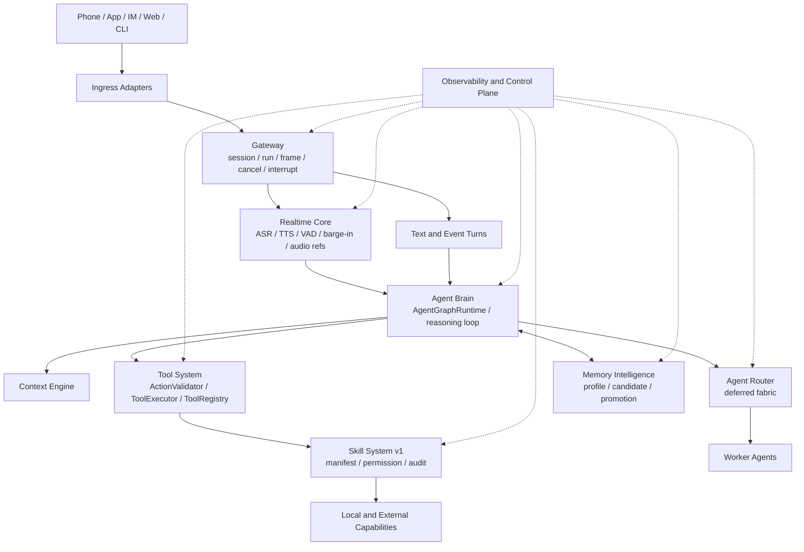

# Personal Realtime AI Assistant Architecture Roadmap

> 本文档定义 `assistant_agent` 未来 1 到 3 年作为 Personal Realtime AI Assistant 的演进路线。
> 它不是单个功能计划，也不替代 Gateway、Tool、Memory、Context、Observability 等权威架构文档。

## 文档定位

`assistant_agent` 的目标重新定义为长期演进的个人实时通话 AI 助理：

- 实时语音交互
- 长期记忆和人格连续性
- 工具执行能力
- Skill 能力生态
- 多入口接入，包括电话、APP、IM、Web 和 CLI
- 长生命周期运行
- 可观察、可调试、可演进

当前工程定位应收敛为 **Personal Realtime AI Assistant Runtime**：

- 不是单纯聊天机器人。
- 不是只给开发者复用的 Agent Runtime Framework。
- 还不是完整 Personal AI OS 或 OS kernel。

长期方向可以演进为 Personal AI OS，但近期工程策略必须是：先做可靠的个人实时助理运行时，用真实通话场景验证 Gateway、Runtime、Tool、Memory、Context 和 Trace 边界，不按完整 OS 架构提前铺平台。

## 节奏控制与反过度设计原则

当前最大的技术风险不是模块不足，而是过早架构化。未来 1 到 3 年的目标架构只作为 north star，不代表现在要启动完整 OS、marketplace、agent fabric 或 RL pipeline。

近期判断：

- 当前阶段：Personal Realtime AI Assistant Runtime。
- 下一阶段：更可靠的个人实时助理产品内核。
- 远期方向：在身份、权限、后台任务、能力生态和长期审计成熟后，演进为 Personal AI OS。

未来 3 到 6 个月只允许增加三类核心能力：

- Realtime Core：让电话式实时交互编排可靠，不建设语音技术平台。
- Memory Intelligence v1：让助理开始认识用户，但只做 candidate memory -> judge -> profile memory -> recall 的窄闭环。
- Skill System v1：让能力模块化，但只做 manifest、permission、tool mapping、enable/disable 和 audit。

任何新增架构边界必须先回答三问：

- 是否直接提升个人实时助理的 10 分钟通话体验？
- 是否可以通过现有 Gateway、Runtime、Tool、Memory、Context 或 Trace 边界扩展？
- 是否引入新的长期维护边界？

如果答案只是“未来可能有用”，不进入近期实现。

明确延后：

- RL pipeline 和自动学习训练。
- Skill marketplace、社区 skill、用户上传 skill 和审核平台。
- 完整 multi-agent fabric、agent swarm 和自动远程 agent discovery。
- Personal OS control plane、设备管理、后台自主进程和复杂 scheduler。
- 大规模 provider/platform 接入。

借鉴关系应保持克制：

- OpenClaw 提供产品形态和多入口启发。
- `assistant_agent` 提供工程骨架和运行时边界。
- Hermes 只借鉴 Skill、Memory evolution 和 trajectory debug 经验。

不要复制任一项目的大系统形态。

## 当前架构评估

### 已完成

- Agent 主循环：`AgentGraphRuntime` 已经是统一大脑入口，支持 provider-native tool calls、mock/offline 路径、loop guard、trace/event 记录。
- 工具治理边界：`AssistantDecision -> ActionValidator -> ToolExecutor -> ToolRegistry -> Tool` 已经成型。
- Gateway 生命周期：已有 session、run、cancel、interrupt、hangup、stream frame、reconnect 语义。
- Memory Service：已有 `MemoryManager`、读写 policy、user profile、audit、export、delete、retention、snapshot 方向。
- Context Engineering：已有 `AssistantContextPack`、session summary、memory context 注入、tool observation compaction、context report。
- Observability：已有 run、tool、LLM、context、gateway、memory 事件模型、trace store、redaction 规则。
- Multi-agent routing：已有 `assistant_agent.agent_routing`、`AgentRouter`、`AgentDirectory`、A2A/JSON-RPC adapter、`delegate_to_agent` opt-in 方向。

### 部分完成

- 实时语音：Gateway/media frame 和 realtime adapter 方向正确，但核心仍偏 turn-based text runtime；ASR、TTS、VAD、barge-in、低延迟流式闭环还不完整。
- 长生命周期运行：session/run lifecycle 有，但 `GatewaySessionService` 等仍偏进程内状态，缺少 durable run/session store 和跨进程恢复。
- 记忆智能：policy、profile、分层模型有，但 retrieval 仍偏 deterministic/keyword/local；缺少 embedding、冲突解决、时间线建模、长期偏好演化。
- Skill 生态：已有 capability catalog 和 repo-local `skills/<skill_id>/SKILL.md` loader，但还不是完整用户级 Skill System。
- 多入口接入：CLI/API/Web/Gateway facade 都有基础，但部分入口仍可绕过 Gateway 直接进入 `AssistantRuntimeApp`。
- 多 agent：协议和本地 opt-in 路径有，但还不是生产级 agent fabric。
- 学习闭环：trace/eval 基础有，但近期只应停留在 debug 和 redacted replay；完整 trajectory collection -> replay -> eval -> skill/memory improvement 属于远期闭环。

### 缺失

以下是长期缺口，不代表近期实施范围。

- 生产级 Realtime Core：流式 ASR、TTS、VAD、turn-taking、barge-in、jitter/latency budget、音频引用生命周期。
- Durable personal runtime：长期任务、后台 job、计划任务、跨进程恢复、确认/撤销 ledger。
- 用户级 Skill System：权限、测试、版本、来源、回滚、用户授权。Marketplace 不属于近期目标。
- Memory Intelligence：candidate memory、promotion、profile 冲突、记忆质量评估，远期才演进为完整 Memory Brain。
- Personal OS control plane：设备、通知、身份、权限、后台任务、长期审计。当前只记录为远期方向。
- 产品级 consent UX：高风险工具确认、可撤销动作、敏感数据最小化。

## 应保留的架构资产

### AgentGraphRuntime

应保留为 Agent Brain 的核心执行器。它已经把 provider、tool、memory、context、trace、session history 组合在一个清晰运行时里。未来可以改内部 loop，但不应另起一个并行大脑。

### Gateway lifecycle

应保留，而且应成为所有入口的统一生命周期边界。Gateway 负责 session、run、frame、cancel、interrupt、hangup、queueing、reconnect，不负责思考。这样电话、Web、IM、CLI 不会各自长出一套 Agent 逻辑。

### ToolExecutor / ActionValidator

必须保留为硬边界。Personal Assistant 最危险的是“会做事”，不是“会聊天”。任何工具、skill、agent delegation 都必须经过 validator、executor、registry、policy、audit。

### Memory Service

应保留为独立能力边界。当前设计已经把 conversation history、context summary、long-term memory 区分开，这是正确方向。未来 Memory Brain 可以增强，但 memory tools 仍应保持薄层。

### Context Service

应保留为 Agent Brain 的上下文编译层。它承担 history、summary、memory context、tool observation compaction、budget report。未来应增强 token-aware 和 realtime task-state，而不是把上下文拼接散落到各入口。

### Observability

必须保留并前置。Personal Assistant 的长期可持续演进依赖可追踪：为什么调用工具、为什么读写记忆、为什么中断、哪一层失败。没有 trace，后续 memory、skill、learning loop 都不可控。

## 未来阻碍点

- `AssistantRuntimeApp` 仍是多个产品入口的直接边界；长期应让 CLI、API、Web、IM、Phone 统一收敛到 Gateway ingress。
- `GatewaySessionService` 当前偏进程内 session/run 管理；长生命周期需要 durable store、恢复、幂等和跨进程 run ownership。
- `AgentGraphRealtimeBackend` 用 thread 包住 turn-based runtime，适合过渡，不适合作为低延迟全双工语音核心。
- `AgentGraphRuntime._run_native_runtime` 当前每轮主要执行第一个 native tool call；未来复杂任务需要更强的 tool scheduling、并发策略和 streaming observation。
- `ToolExecutor` 的风险 gate、idempotency、确认链路目前仍偏本地进程；未来个人助理需要持久 confirmation ledger，但 Phase 0 不实现。
- `MemoryManager` 当前还不是 Memory Intelligence：缺少 candidate promotion、冲突处理、质量评估和长期画像演化。embedding/vector 只能在本地 eval 证明 keyword 不够后再引入。
- Context budget 当前主要是 char-budget/report；长期多模态实时上下文需要强 token 预算和分层裁剪策略。
- `agent_routing` 当前默认禁用是正确的，但未来若没有 durable delegation trace 和 child memory isolation，会阻碍多 agent 扩展。
- Skill loader 现在更像上下文能力目录，不是完整运行时 skill package；需要避免和 Codex repo skill 概念混淆。

## 目标架构

未来 1 到 3 年可以按以下逻辑系统演进。该图是 north star，不是近期拆模块清单。初期不建议直接拆成多个微服务，先拆职责和接口；当单进程模块边界稳定后，再按延迟、隐私、部署需求拆进程。

近期 3 到 6 个月只推进图中的 Gateway / Realtime Core / Agent Brain / Memory Intelligence v1 / Skill System v1 最小闭环；Agent Router、Learning Loop、OS control plane 保持延后。



### Gateway

负责入口归一化和生命周期，不负责智能。它接收来自电话、APP、IM、Web、CLI 的事件，转成统一 session/run/frame。它决定 cancel、interrupt、hangup、queueing、reconnect。

### Realtime Core

负责实时交互编排，而不是语音模型或音频基础设施。ASR、TTS、VAD 应作为 mock/local/provider adapter 接入；核心价值是 audio stream、turn detection、agent state、tool interruption、response scheduling、TTS stream、latency budget 和 audio refs 的协调。它不自研 ASR/TTS/声学模型，不做工具选择，不写长期记忆，不直接调用外部业务工具。

### Agent Brain

负责思考和编排。当前 `AgentGraphRuntime` 应演进为这里的核心。它选择工具、决定是否读写记忆、管理多轮推理、调用 agent router，但所有外部动作仍走 Tool System。

### Memory Intelligence / Future Memory Brain

负责人格连续性和长期记忆。近期 v1 不做复杂 Memory Brain，只做 `candidate memory -> LLM/rule judge -> profile memory -> recall` 的窄闭环，并覆盖确认、拒写、profile supersede 和 eval。不要提前引入 episodic memory、semantic memory、procedural memory 等分类体系；远期再按真实使用证据扩展语义合并、遗忘、审计和导出。

### Tool System

负责所有可执行能力的治理。包括 `ToolSpec`、`ActionValidator`、`ToolExecutor`、side-effect policy、confirmation、idempotency、audit、rollback metadata。

### Skill System

负责能力模块化。近期 Skill System v1 只做最小 manifest：`name`、`tools`、`prompt`、`permissions`，再加本地 registry、启用/禁用和审计。早期 skill 不拥有 workflow engine、memory schema 或独立 eval system，避免变成第二套 Runtime；它不做 marketplace，不允许任意代码执行，也不应绕过 Tool System。

### Observability / Control Plane

横切所有层。近期只做 developer harness：trace、metrics、redaction、run replay、debug timeline、memory/tool/skill audit。这里的 control plane 不是 Personal OS control plane，不包含设备管理、后台自主任务或用户侧平台治理。

## 开发路线图

路线图按基础能力依赖关系推进，不按功能清单堆叠。

### Phase 0：架构稳定

为什么现在做：

- 当前边界已经不错，最大风险是后续入口、语音、skill 各自绕路。
- 必须先让 Gateway、Runtime、Tool、Memory、Context、Trace 的职责固定下来。
- Phase 0 只做 1 到 2 周的架构门禁，不做长期架构整理项目。

依赖：

- 现有 Gateway、`AgentGraphRuntime`、`ToolExecutor`、`MemoryManager`、Context Pack、Trace。

需要新增：

- 入口收敛准则。
- Gateway canonical path contract。
- 兼容入口和迁移债清单。
- 核心 trace invariants。

不应该做：

- 大规模重构。
- 换语言重写 Gateway。
- 引入第二套 Agent loop。
- 实现或展开设计完整 durable runtime。
- 超过两周继续打磨抽象而不进入 realtime loop。

### Phase 1：文本实时编排闭环

为什么现在做：

- Personal Realtime Assistant 的产品壁垒首先是实时交互，不是更多工具。
- 没有稳定通话闭环，后续 memory 和 skill 都无法在真实使用场景中验证。
- 当前仓库不做 ASR/TTS；媒体服务完成语音输入输出，本仓库先把文本 turn-taking、interrupt、hangup 和 runtime trace 跑稳。

依赖：

- Gateway lifecycle。
- Realtime adapter。
- Context call-state。
- Observability timeline。

需要新增：

- Realtime text orchestration adapter contract。
- Media Relay text event contract：`session.start -> transcript.final -> run.end -> session.end`。
- interrupt / cancel / hangup lifecycle tests。
- text call simulator。
- frame/trace/latency metrics。

不应该做：

- 一开始接入大量电话/IM 平台。
- 自研 ASR、TTS、声学模型或复杂音频基础设施。
- 在 `assistant_agent` 内实现 ASR/TTS/VAD；这些属于媒体服务。
- 做复杂语音克隆。
- 让媒体层直接持有大脑逻辑。

### Phase 2：Memory Intelligence v1

为什么现在做：

- 没有长期记忆，就只是实时聊天工具。
- 有工具但无记忆，也不是个人助理。

依赖：

- `MemoryManager`。
- `MemoryReadPolicy`。
- `MemoryWritePolicy`。
- Context injection。
- Trace。

需要新增：

- candidate memory。
- LLM/rule judge。
- profile memory。
- recall report。
- memory promotion。
- profile supersede。
- memory eval。
- 记忆确认 UX。
- 记忆质量报告。

不应该做：

- 默认自动保存所有用户原话。
- 把 raw provider response 写入记忆。
- 默认远程记忆服务。
- 提前设计 episodic/semantic/procedural memory 分类体系。
- 在没有 eval 证据前引入复杂向量库、Memory Brain 或外部 memory platform。

### Phase 3：Skill System v1

为什么现在做：

- 个人助理的能力增长不能靠不断往 core 里塞工具。
- Skill 必须建立在工具治理和记忆边界稳定之后。

依赖：

- Tool System 稳定。
- side-effect policy。
- Memory Intelligence v1。
- Context capability catalog。

需要新增：

- Skill manifest。
- permission model。
- local skill registry。
- skill audit。
- enable/disable flow。

不应该做：

- 开放任意代码执行。
- 绕过 `ToolExecutor` 的 plugin。
- 在 v1 引入 workflow engine、memory schema 或独立 eval system。
- 过早做 marketplace。
- 用户上传 skill、社区 skill、审核平台。

### Phase 4：Multi-agent Fabric

为什么现在做：

- 多 agent 只有在工具、记忆、skill 边界稳定后才有意义。
- 否则会把复杂度提前放大。
- 默认不进入未来 3 到 6 个月路线。

依赖：

- Skill System。
- Tool System。
- `AgentRouter`。
- delegation policy。
- memory isolation。

需要新增：

- worker agent contract。
- durable delegation trace。
- artifact handoff。
- child-agent memory boundary。
- deterministic target selection hardening。

不应该做：

- 自动发现远程 agent。
- 默认启用 agent swarm。
- 让子 agent 继承父 agent 原始记忆上下文。
- 早期用多 agent 代替一个强 Agent 加 Skill。

### Phase 5：Trajectory Debug / Learning Loop

为什么现在做：

- 长期演进需要从真实轨迹中改进。
- 近期只做 trajectory debug 和 redacted replay；learning loop 和 RL pipeline 必须等 trace、skill、memory 稳定后再做，否则会把错误自动固化。

依赖：

- Observability。
- trajectory store。
- eval harness。
- memory/skill audit。

需要新增：

- trajectory collection。
- redacted replay。
- feedback labels。
- skill improvement pipeline。
- memory quality regression test。

不应该做：

- 生产环境自动自我修改。
- 用未脱敏私人数据训练。
- 无审批地改变用户偏好和工具策略。
- 早期建设 RL pipeline。

## Hermes Agent / OpenClaw 对比

### 应借鉴

- Hermes 的 trajectory 思想：近期只用于 debug、replay 和 eval，不进入 RL pipeline，不直接训练私人原始数据。
- Hermes 的 memory evolution 思路：FTS/SQLite、压缩、批处理、promotion 值得参考，但本项目应保持 local-first 和 policy-first。
- Hermes 的 Skill 安全扫描方向：Skill 不只是 prompt 文件，应有权限、测试、风险标注，但不做 marketplace。
- Hermes/OpenClaw 的 gateway ecosystem：多平台入口值得借鉴，但应作为薄 adapter 接入 Gateway。
- OpenClaw 的插件/扩展生态：适合启发 Skill System，但不能让插件绕过 runtime governance。

### 不应照搬

- 不要照搬 Hermes 大单体 `AIAgent`。本项目已经有 Gateway、Runtime、Tool、Memory、Context 分层，回到大单体会破坏长期演进。
- 不要让 Gateway 持有大脑。Gateway 只能管生命周期和 frame，否则电话、IM、Web 会长出不同智能逻辑。
- 不要允许 Tool bypass runtime。任何 skill、plugin、agent delegation 都必须经过 `ActionValidator` 和 `ToolExecutor`。
- 不要照搬 import-time global tool registry 和 JSON-string tool results。当前结构化 `ToolSpec` / `ToolResult` 更适合审计和安全。
- 不要为了生态过早接 10 个平台、15 个 provider。当前核心壁垒是实时闭环、记忆连续性、工具治理。
- 不要引入 Hermes 的大系统推进方式。当前只吸收 Skill、Memory evolution、Trajectory debug 三类产品能力。

## 近期 3 个月开发计划

假设只有一个开发者，优先构建核心壁垒。

三个月内只做：

- Realtime Assistant Loop。
- Memory Intelligence v1。
- Skill System v1。

不以完整 AI OS、marketplace、multi-agent fabric 或 RL pipeline 为阶段目标。
Phase 0 以两周为上限；Phase 1 打通第一个 realtime loop 后，Phase 2 的 memory eval 和 candidate memory 可以交叉推进。

### 第 1 周：冻结目标架构边界

- 列出现有入口路径。
- 明确 Gateway canonical path。
- 明确不得绕过的 runtime、tool、memory 边界。
- 输出阶段验收标准。

### 第 2 周：补齐关键 contract 和 trace invariant

- 覆盖 Gateway、Runtime、Tool、Memory 的关键状态转换。
- 确认 validation rejection 不进入 `ToolExecutor`。
- 确认每个 run 和 tool call 都有 terminal event。

### 第 3 周：打通 mock realtime media loop

- 覆盖 `session.start -> transcript.final -> response -> session.end`。
- 只使用 audio refs，不引入 raw audio 持久化。
- 输出可重复运行的 call simulation。

### 第 4 周：稳定 interrupt/cancel/barge-in

- 明确普通消息 queueing 和 explicit interrupt 的差异。
- 确保 Gateway、runtime、trace 对同一 run 的状态一致。
- 验证 hangup 会取消 active run。

### 第 5 周：本地语音闭环 demo

- 使用 mock 或本地 provider。
- 完成一通多轮电话式会话。
- 记录 latency、cancel、final response、trace。

### 第 6 周：realtime debug timeline

- 串联 Gateway frames、LLM decision、tool call、memory read/write、latency。
- 保持 redaction。
- 用一个页面或 CLI 报告即可，不做复杂平台。

### 第 7 周：memory eval baseline

- 覆盖偏好保存、偏好召回、冲突覆盖、隐私拒写、跨 session continuity。
- 建立可重复运行的 memory regression cases。

### 第 8 周：Memory Intelligence v1

- 打通 candidate memory -> judge -> profile memory -> recall。
- 增强 profile supersede。
- 增加 memory confidence。
- 增加 explicit confirmation。
- 输出 retrieval report。

### 第 9 周：个人连续性场景

- 用户偏好。
- 长期任务摘要。
- 会话恢复。
- 拒绝保存敏感信息。

### 第 10 周：Skill manifest v1

- 定义 skill 声明格式。
- 包含 `name`、`tools`、`prompt`、`permissions`、启用/禁用。
- 不允许 skill 绕过 Tool System。

### 第 11 周：接入一个高价值本地 skill

- 选择一个个人助理核心场景，例如个人任务整理或每日简报。
- 必须走 `ActionValidator -> ToolExecutor -> ToolRegistry`。
- 输出 skill audit。

### 第 12 周：pilot evidence package

- 运行 60 分钟级别会话。
- 覆盖打断、记忆、工具、skill、trace、失败恢复。
- 输出下一季度决策依据。

### 3 个月内不做

- 完整多 agent fabric。
- 远程 agent 市场。
- Skill marketplace。
- 大规模 provider 适配。
- 复杂前端。
- 自动学习训练。
- RL pipeline。
- Personal OS control plane。
- 大规模重构。

## 阶段验收标准

### Phase 0 Gate

- 所有新入口都有明确 Gateway 收敛路径。
- 文档中不存在新的 tool bypass runtime 设计。
- trace invariants 可被测试或脚本验证。
- Product text/realtime entries have static contract tests proving Gateway-first routing.
- Tool governance has a rejection test proving invalid native tool calls do not enter `ToolExecutor`.
- Representative mock/offline and native traces pass `TraceInvariantObserver`.
- Memory, context, and delegation boundaries have regression tests that prevent obvious ownership drift.
- Gateway lifecycle invariants are covered: active run hangup cancels, completed run hangup does not cancel, trusted entry source overrides client metadata source, text-only realtime turns do not create media refs, and explicit interrupt starts a replacement turn.

#### Phase 0 Architecture Gate Commands

Run before starting Phase 1:

```bash
/home/lenovo1/miniconda3/envs/hello_agent/bin/python scripts/check_env.py
/home/lenovo1/miniconda3/envs/hello_agent/bin/python -m pytest tests/test_phase0_entrypoint_contracts.py tests/test_architecture_boundaries.py -q
/home/lenovo1/miniconda3/envs/hello_agent/bin/python -m pytest tests/test_gateway.py tests/test_gateway_session.py tests/test_gateway_api.py tests/test_gateway_turn_facade.py tests/test_assistant_cli.py tests/test_realtime_agent_backend.py tests/test_realtime_event_mapping.py tests/test_realtime_backend_types.py -q
/home/lenovo1/miniconda3/envs/hello_agent/bin/python -m pytest tests/test_phase0_tool_governance_contracts.py tests/test_tool_call_boundaries.py tests/test_tool_executor.py tests/test_tool_risk_gate.py tests/test_mcp_server_skeleton.py -q
/home/lenovo1/miniconda3/envs/hello_agent/bin/python -m pytest tests/test_phase0_trace_invariant_gate.py tests/test_hook_invariants.py tests/test_observability_harness.py tests/test_trace_query_api.py tests/test_trace_redaction.py -q
/home/lenovo1/miniconda3/envs/hello_agent/bin/python -m pytest tests/test_phase0_service_boundary_contracts.py tests/test_memory_tool_boundary.py tests/test_memory_manager.py tests/test_memory_read_policy.py tests/test_assistant_context_renderer.py tests/test_agent_communication_routing.py tests/test_agent_router.py -q
/home/lenovo1/miniconda3/envs/hello_agent/bin/python -m pytest -m fast -q
git diff --check -- AGENTS.md docs src tests scripts
```

### Phase 1 Gate

- 本地可跑完整 text-only realtime 通话模拟：媒体服务输入 finalized text，本仓库输出 text Gateway frames。
- interrupt、cancel、hangup 的 trace 和 Gateway frame 一致。
- ASR/TTS/VAD 不作为 `assistant_agent` 的 Phase 1 验收范围。
- 媒体层不持有大脑逻辑。
- Gate commands:

```bash
/home/lenovo1/miniconda3/envs/hello_agent/bin/python scripts/run_realtime_call_simulator.py --scenario basic
/home/lenovo1/miniconda3/envs/hello_agent/bin/python scripts/run_realtime_call_simulator.py --scenario interrupt
/home/lenovo1/miniconda3/envs/hello_agent/bin/python -m pytest tests/test_gateway_api.py tests/test_realtime_call_simulator.py tests/test_realtime_event_mapping.py -q
```

### Phase 2 Gate

- `assistant_candidate` memory is audit-only by default and does not persist without user confirmation or policy approval.
- Explicit user memory can update durable profile memory.
- Conflicting profile preferences supersede older active preferences deterministically.
- Active recall excludes superseded profile sources.
- Sensitive explicit memory requires pending confirmation before durable write.
- Local memory eval remains green without embedding/vector dependencies.
- Gate commands:

```bash
/home/lenovo1/miniconda3/envs/hello_agent/bin/python -m pytest tests/test_phase2_memory_intelligence_gate.py -q
/home/lenovo1/miniconda3/envs/hello_agent/bin/python -m pytest tests/test_memory_manager.py tests/test_memory_retrieval_eval.py tests/test_memory_audit_api.py tests/test_native_tool_call_handoff.py -q
/home/lenovo1/miniconda3/envs/hello_agent/bin/python scripts/run_evals.py --suite memory
```

### Phase 3 Gate

- Skill manifests can declare governed tools and `tool:<name>` permissions.
- Disabled, manual-only, invalid, unavailable-tool, or under-permissioned skills are omitted from prompt context with prompt-safe issues.
- Skill descriptors are capability metadata only; there is no `run_skill`, direct `registry.run(...)`, marketplace, user-uploaded skill, or arbitrary code execution path.
- Any actual capability execution still goes through `ActionValidator -> ToolExecutor -> ToolRegistry`.
- Gate commands:

```bash
/home/lenovo1/miniconda3/envs/hello_agent/bin/python -m pytest tests/test_phase3_skill_system_gate.py tests/test_skill_loader.py tests/test_tool_catalog.py -q
/home/lenovo1/miniconda3/envs/hello_agent/bin/python -m pytest tests/test_phase0_tool_governance_contracts.py tests/test_tool_executor.py tests/test_architecture_boundaries.py -q
```

### Phase 4 Gate

- child agent 不接收父 agent 原始记忆上下文，且 control-plane 持久化前会过滤父级 raw memory/context metadata。
- delegation 有显式 opt-in 的本地 JSONL durable trace；默认 `AgentRouter` 仍使用 process-local store。
- repeated-pair、ping-pong 和 depth control 生效。
- Phase 4 当前只完成 readiness gate，不代表默认启用 multi-agent fabric、agent swarm、远程自动发现或 LLM 自动选 agent。
- Gate commands:

```bash
/home/lenovo1/miniconda3/envs/hello_agent/bin/python -m pytest tests/test_phase4_multi_agent_readiness_gate.py -q
/home/lenovo1/miniconda3/envs/hello_agent/bin/python -m pytest tests/test_agent_communication_routing.py tests/test_agent_router.py tests/test_agent_routing_policy.py tests/test_api_a2a.py tests/test_a2a_json_rpc_transport.py tests/test_agent_pilot_readiness.py tests/test_api_agent_graph_runtime.py -q
```

### Phase 5 Gate

- trajectory replay 使用 `TrajectoryReplayCase` 脱敏数据，只保留 prompt-safe timeline。
- learning loop 不会自动修改生产策略、memory、skill、prompt、routing、tool policy 或 provider policy；早期只允许 debug/replay/eval 和 manual review gate。
- memory 和 skill 改进必须分别有 regression eval 证据，缺少目标 eval 时不得进入人工审查。
- Gate commands:

```bash
/home/lenovo1/miniconda3/envs/hello_agent/bin/python -m pytest tests/test_phase5_trajectory_debug_gate.py -q
/home/lenovo1/miniconda3/envs/hello_agent/bin/python -m pytest tests/test_phase2_memory_intelligence_gate.py tests/test_phase3_skill_system_gate.py -q
```

## 与现有权威文档的关系

- Gateway 细节以 `docs/gateway-architecture.md` 为准。
- Tool calling 细节以 `docs/tool-calling-architecture.md` 为准。
- Memory 细节以 `docs/memory-service-architecture.md` 为准。
- Context engineering 细节以 `docs/CONTEXT_ENGINEERING_STATUS.md` 为准。
- Multi-agent routing 细节以 `docs/agent-communication-routing.md` 为准。
- Observability 细节以 `docs/observability-harness.md` 为准。

本路线图只定义长期方向、阶段依赖和近期优先级。进入具体开发时，每个阶段应再拆成独立实施计划和可验证任务。
